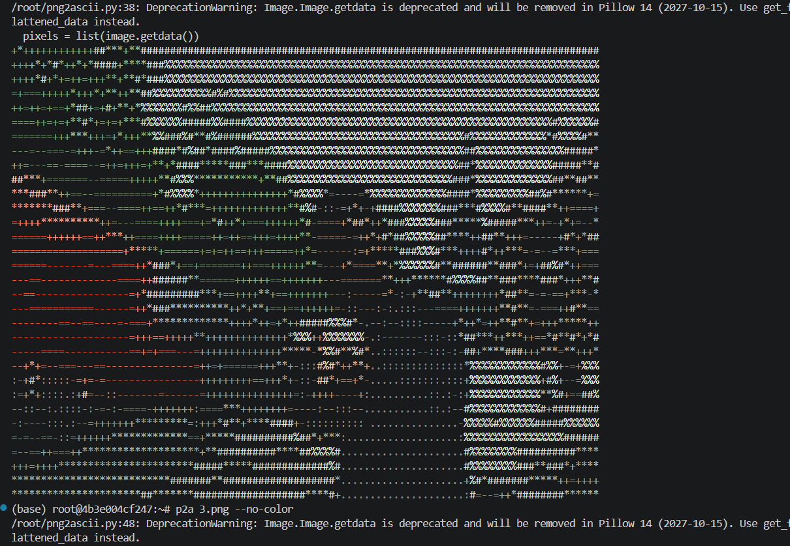
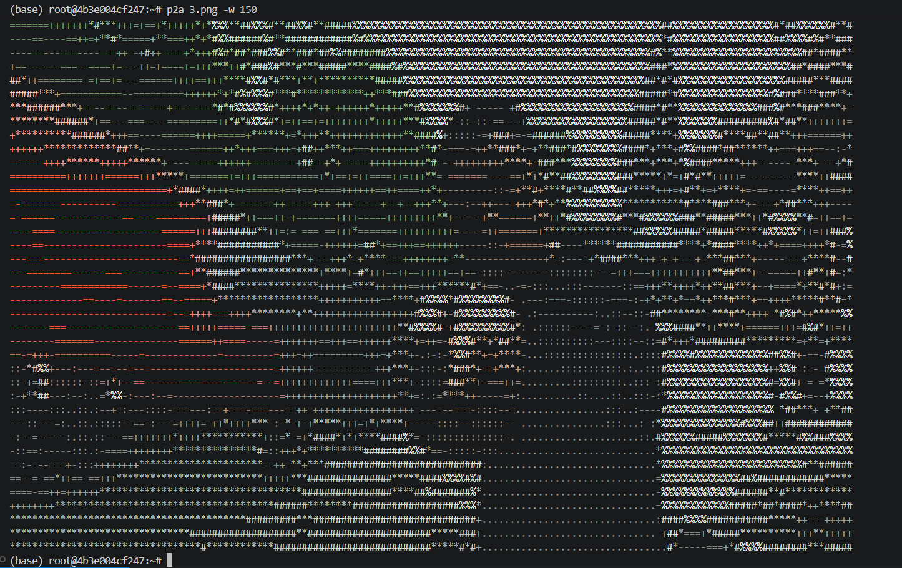
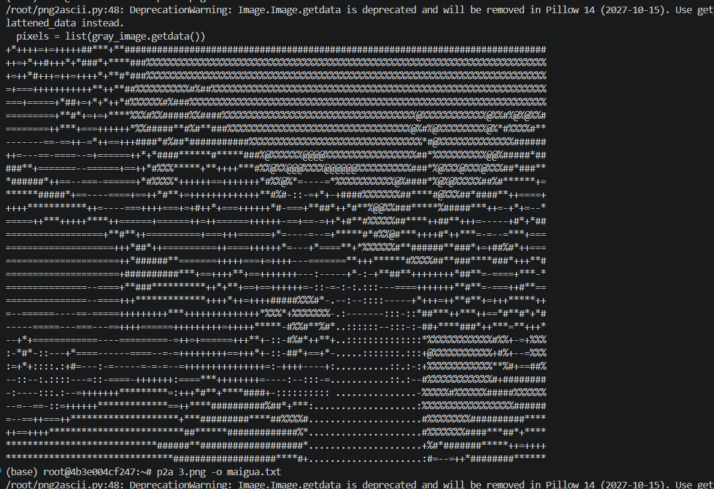

# linux工具作业p2a

~~最近刚学了md怎么写，顺便用这个练练手。~~


## 下载方式
是用debian写的不知道其他是怎么样。。

```
pip install pillow
echo "deb [trusted=yes] https://Tukist.github.io/my-apt-repo/ stable main" | tee /etc/apt/sources.list.d/p2a.list
apt update
apt install p2a
```

## 功能

这个工具`p2a`就是可以把一般linux没法直接打开的**png文件转化成字符画输出**

- 可以选择输出路径

- 可以选择是黑白还是彩色

- 可以选择宽度

效果如下

<!-- [跳转到方法论部分](#方法论) -->


<p align="center">原图</p>


<p align="center">彩色转化图</p>


<p align="center">更大的彩色转化图</p>


<p align="center">黑白转化图</p>

## 用法

函数名为`p2a`，一般用法为`p2a target.png`，其他参数为

```
-h, -?, --help       显示此帮助信息并退出
-w, --width WIDTH    输出字符画的宽度 (默认: 100)
-o, --output OUTPUT  输出文件路径 (默认: 输出到终端)
--color              启用彩色输出（如果输出到终端）
--no-color           禁用彩色输出
```

示例:
```bash
p2a.py image.png
p2a.py image.png -w 80
p2a.py image.png -o output.txt
p2a.py image.png -w 120 > art.txt
p2a image.png --no-color
```

## 实现方法

首先用python写好代码，然后用`scp`发送到linux服务器上用`chmod`赋予可执行权限。

安装打包依赖

```bash
apt update
apt install dpkg-dev gzip git build-essential
apt install devscripts debmake
```

然后整理一下打包项目结构，顺便给个权限

```bash
mkdir -p p2a/usr/bin
mkdir -p p2a/DEBIAN
cp png2ascii.py p2a/usr/bin/p2a
chmod +x p2a/usr/bin/p2a
```

写包控制信息，应该是不能出现中文的

`vim p2a/DEBIAN/control`

```vim
Package: p2a
Status: install ok installed
Maintainer: Tukist <2590568618@qq.com>
Architecture: all
Version: 1.0.0
Depends: python3 (>= 3.6)
Description: a tool to output PNG as ASCII art
  Black-and-white mode or color mode
  you can choose width
  -h to check the usage
Depends: python3 (>=3.6)
```

打包

`dpkg-deb --build --root-owner-group p2a`

---

然后就要开始做apt源了

```bash
mkdir -p ~/my-apt-repo/pool/main/m/p2a
mkdir -p ~/my-apt-repo/dists/stable/main/binary-amd64
cp p2a.deb ~/my-apt-repo/pool/main/m/p2a/
```

生成apt的索引文件

```bash
cd ~/my-apt-repo
dpkg-scanpackages pool/ /dev/null | gzip -9c > dists/stable/main/binary-amd64/Packages.gz
```

然后建个仓库my-apt-repo，回到Debian终端

```bash
cd ~/my-apt-repo
git init
git add .
git commit -m "init my apt repo"
git remote add origin git@github.com:Tukist/my-apt-repo.git
git push -u origin main
```

其中代码原理就是用十种字符代替颜色深浅，然后用颜色码来模拟颜色，遍历图片像素块然后转化。

<<<<<<< HEAD
~~制作中间最大的问题可能还是不知道要开ssh的权限所以scp命令一直报错，后面才知道要用`sed -i 's/PermitRootLogin no/PermitRootLogin yes/' /etc/ssh/sshd_config`,以及怎么打包成deb~~
=======
~~制作中间最大的问题可能还是不知道要开ssh的权限所以scp命令一直报错，后面才知道要用`sed -i 's/PermitRootLogin no/PermitRootLogin yes/' /etc/ssh/sshd_config`开权限~~
>>>>>>> 582736e43a2baf8773aa5eca9dc8382ba7250113

## 代码

```py {.line-numbers} 
#!/usr/bin/env python3
"""
PNG to ASCII Art Converter
将PNG图像转换为ASCII字符画
"""

import argparse
import sys
from PIL import Image

# ASCII字符集，从暗到亮排列
ASCII_CHARS = [' ', '.', ':', '-', '=', '+', '*', '#', '%', '@']

def resize_image(image, new_width=100):
    """调整图像大小"""
    width, height = image.size
    ratio = height / width / 1.65  # 1.65是字符的高宽比补偿
    new_height = int(new_width * ratio)
    return image.resize((new_width, new_height))

def alpha_composite(image):
    """如果图像带透明通道，则与白色背景合并"""
    if image.mode in ('RGBA', 'LA') or (image.mode == 'P' and 'transparency' in image.info):
        alpha_image = image.convert('RGBA')
        background = Image.new('RGB', alpha_image.size, (255, 255, 255))
        background.paste(alpha_image, mask=alpha_image.split()[3])
        return background
    return image.convert('RGB')

def grayify(image):
    """将图像转换为灰度图"""
    return image.convert('L')

def pixels_to_ascii(image, use_color=False):
    """将像素值转换为ASCII字符"""
    if use_color:
        image = alpha_composite(image)
        pixels = list(image.getdata())
        characters = []
        for r, g, b in pixels:
            luminance = int(0.2126 * r + 0.7152 * g + 0.0722 * b)
            index = int(luminance / 255 * (len(ASCII_CHARS) - 1))
            char = ASCII_CHARS[index]
            characters.append(f"\x1b[38;2;{r};{g};{b}m{char}")
        return characters

    gray_image = grayify(image)
    pixels = list(gray_image.getdata())
    characters = ""
    for pixel in pixels:
        index = int(pixel / 255 * (len(ASCII_CHARS) - 1))
        characters += ASCII_CHARS[index]
    return characters

def convert_to_ascii(image_path, width=100, output_file=None, color=None):
    """转换PNG图像为ASCII字符画"""
    try:
        image = Image.open(image_path)
        image = resize_image(image, width)

        color_enabled = color if color is not None else (output_file is None)
        ascii_art = pixels_to_ascii(image, use_color=color_enabled)

        ascii_art_lines = []
        for i in range(0, len(ascii_art), width):
            line = ''.join(ascii_art[i:i + width])
            if color_enabled:
                line += '\x1b[0m'
            ascii_art_lines.append(line)

        result = "\n".join(ascii_art_lines)

        if output_file:
            with open(output_file, 'w') as f:
                f.write(result)
            print(f"已保存到: {output_file}")
        else:
            print(result)

        return True

    except Exception as e:
        print(f"错误: {e}", file=sys.stderr)
        return False

def main():
    parser = argparse.ArgumentParser(
        description='将PNG图像转换为ASCII字符画',
        formatter_class=argparse.RawDescriptionHelpFormatter,
        epilog='''
示例:
  p2a image.png
  p2a image.png -w 80
  p2a image.png -o output.txt
  p2a image.png -w 120 > art.txt
  p2a image.png --no-color
        ''',
        add_help=False
    )
    parser.add_argument('-h', '-?', '--help', action='help',
                        help='显示此帮助信息并退出')
    parser.add_argument('input', help='输入的PNG文件路径')
    parser.add_argument('-w', '--width', type=int, default=100, 
                        help='输出字符画的宽度 (默认: 100)')
    parser.add_argument('-o', '--output', type=str, default=None,
                        help='输出文件路径 (默认: 输出到终端)')
    parser.add_argument('--color', dest='color', action='store_true',
                        help='启用彩色输出（如果输出到终端）')
    parser.add_argument('--no-color', dest='color', action='store_false',
                        help='禁用彩色输出')
    parser.set_defaults(color=None)
    
    args = parser.parse_args()
    
    success = convert_to_ascii(args.input, args.width, args.output, args.color)
    sys.exit(0 if success else 1)

if __name__ == '__main__':
    main()
```
